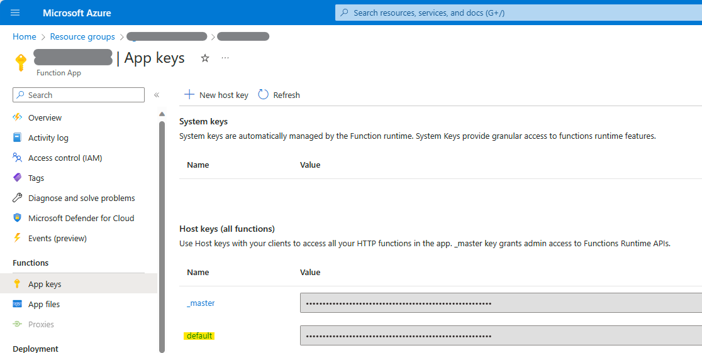

# gpt on your data ingestion

Part of [gpt-rag](https://github.com/Azure/gpt-rag)

## Pre-reqs

- VS Code with Azure Function App Extension 

## Quick start

**1) Deploy to Azure** 

In VSCode with [Azure Function App Extension](https://marketplace.visualstudio.com/items?itemName=ms-azuretools.vscode-azurefunctions) go to the *Azure* Window, reveal your Function App **(fning0...)** in the resource explorer, right-click it then select *Deploy*.

**2) Important: Set function key as a secret in Key Vault**

**2.1)** Get the function's **default** key in Azure Portal > Function App (fning0...) > App keys > Host keys > default.

**2.2)** Set the key as a secret with **ingestionKey** name in the key vault via Azure Portal > Key Vault (kv0m...) > App keys > Secrets > Generate/Import.

*Note: If you do not have authorization to set secrets, add a Set secret permission for your user.*
 *You can do that in Secret permissions in the Access policies option of the Key vault service.*

**3) Azure Cognitive Search Setup**

After you have completed the deployment of the function, run the setup operation to create the elements in Cognitive Search. You can do via Azure Portal > Function App (fning0...) > Test it and call search-setup operation in the Function App.

**4) Add source documents to object storage** 

Upload your documents to the *documents* folder in the storage account which name starts with *strag*.

## References

[Cognitive Search Enrichment Pipeline](https://learn.microsoft.com/en-us/azure/search/cognitive-search-concept-intro)

[Azure Open AI Embeddings Generator](https://github.com/Azure-Samples/azure-search-power-skills/tree/57214f6e8773029a638a8f56840ab79fd38574a2/Vector/EmbeddingGenerator)

## Contributing

This project welcomes contributions and suggestions.  Most contributions require you to agree to a
Contributor License Agreement (CLA) declaring that you have the right to, and actually do, grant us
the rights to use your contribution. For details, visit https://cla.opensource.microsoft.com.

When you submit a pull request, a CLA bot will automatically determine whether you need to provide
a CLA and decorate the PR appropriately (e.g., status check, comment). Simply follow the instructions
provided by the bot. You will only need to do this once across all repos using our CLA.

This project has adopted the [Microsoft Open Source Code of Conduct](https://opensource.microsoft.com/codeofconduct/).
For more information see the [Code of Conduct FAQ](https://opensource.microsoft.com/codeofconduct/faq/) or
contact [opencode@microsoft.com](mailto:opencode@microsoft.com) with any additional questions or comments.

## Trademarks

This project may contain trademarks or logos for projects, products, or services. Authorized use of Microsoft
trademarks or logos is subject to and must follow
[Microsoft's Trademark & Brand Guidelines](https://www.microsoft.com/en-us/legal/intellectualproperty/trademarks/usage/general).
Use of Microsoft trademarks or logos in modified versions of this project must not cause confusion or imply Microsoft sponsorship.
Any use of third-party trademarks or logos are subject to those third-party's policies.
